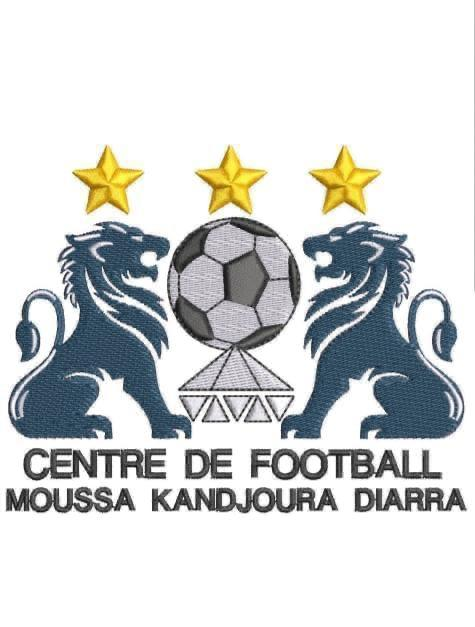

# Centre de Football Moussa Kandjoura Diarra (CF – MKD) 🇲🇱⚽

Official website for **Centre de Football Moussa Kandjoura Diarra (CF – MKD)**, an elite youth football academy dedicated to scouting, educating, and developing young football talents in Mali.

## 🌟 Purpose & Vision

CF – MKD exists to develop football talent and empower young people by combining football with education and discipline. The academy seeks to create safe and credible local pathways to professional football in one of West Africa's most deprived regions, Mali. While future expansion is possible, the academy is deliberately focused on Mali at this stage.

---

## 🎯 5 Core Mission Pillars

- **a. Talent Development from Age 8**: Structured, merit-based training accessible to all regardless of background.
- **b. Education & Life Skills**: Integrating formal education, discipline, and independent life skills alongside football.
- **c. Safe Local Pathways**: Creating credible local pathways reducing the need for dangerous irregular migration or gang affiliations.
- **d. Community Engagement**: Promoting youth wellbeing and positive social cohesion through sport.
- **e. U17 Inter Academic Tournament**: Organizing the flagship national U17 tournament attracting teams from across Mali.

---

## 👥 Leadership & Technical Staff

| Role | Name | Description |
|---|---|---|
| **President of the Club** | **Moussa K Diarra** | Visionary & Club President |
| **Vice President** | **Aliou K Diarra** | General Coordination & Community Relations |
| **Head Coach** | **Lassana Tounkara** | Technical Director & Head Coach |
| **U13 Coach** | **Aliou Diarra** | Youth Technical Development |
| **U8 Coach** | **Mamoutou Soumaré** | Grassroots Training (From Age 8) |
| **Club Doctor** | **Dr. Honoré Kaou** | Chief Medical Officer & Player Health |

---

## 📞 Official Contacts

- **Phone / WhatsApp Line 1**: `+223 71 85 35 40`
- **Phone / WhatsApp Line 2**: `+223 84 02 37 50` / `+223 65 88 56 33`
- **Official Email**: `cfmkd.info@gmail.com`
- **Live Website**: [https://alimire.github.io/cf-moussa-kandjoura-diarra/](https://alimire.github.io/cf-moussa-kandjoura-diarra/)

---

## 🚀 Technologies

- **HTML5**: Semantic markup, Open Graph metadata, multilingual tags.
- **CSS3**: Obsidian dark theme, gold & Mali flag accents, glassmorphism, responsive grids.
- **JavaScript (Vanilla)**: Real-time French 🇫🇷 / English 🇬🇧 translation engine, Lightbox, stats counters, WhatsApp integration.
- **CI/CD**: GitHub Actions deploying automatically to GitHub Pages.

---

© 2026 Centre de Football Moussa Kandjoura Diarra (CF – MKD). All rights reserved.
